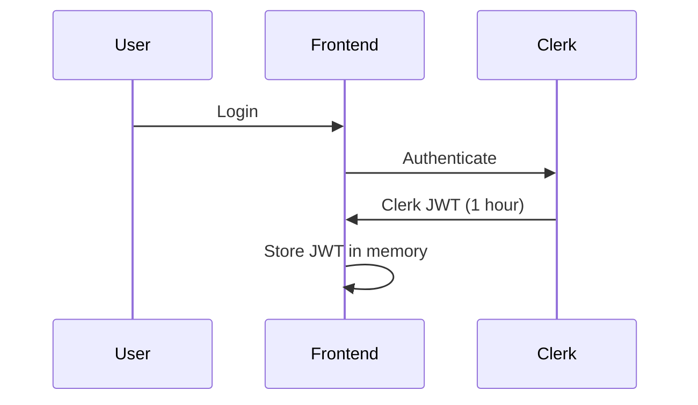
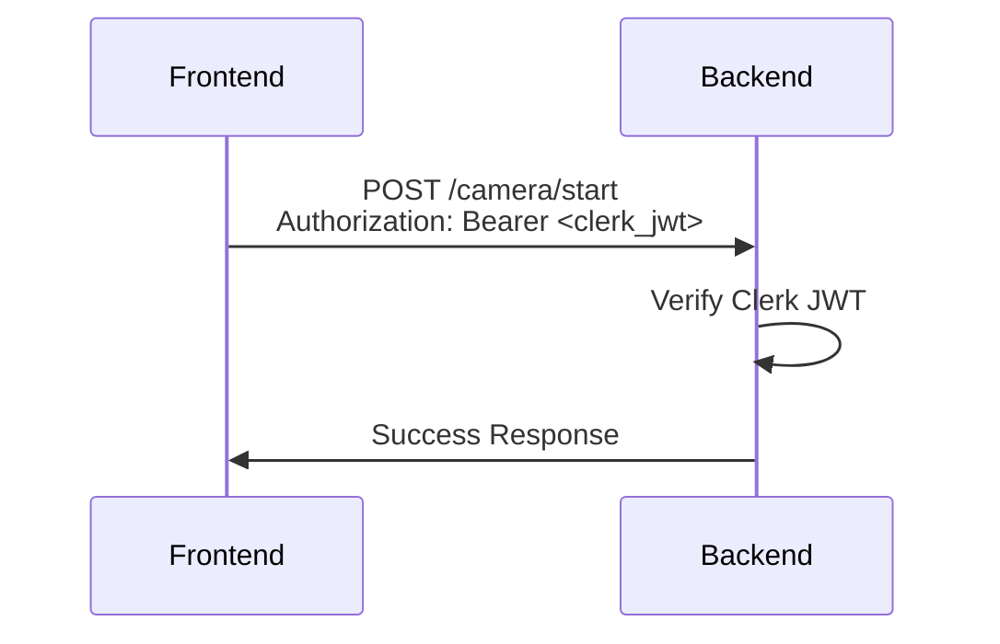
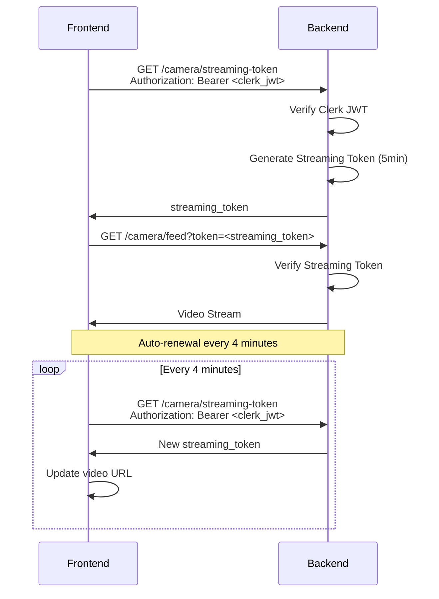

# 🔐 Token System Analysis - 2 Loại Token

## 🎯 **Câu hỏi**: Ta đang có 2 thứ token, Clerk token và streaming token với thời gian sống ngắn hơn?

## ✅ **Trả lời**: ĐÚNG! Có 2 loại token hoàn toàn khác nhau**

---

## 🔑 **1. CLERK JWT TOKEN** (Main Authentication)

### 📋 **Đặc điểm:**
```python
# Được tạo bởi: Clerk Authentication Service
# Algorithm: RS256 (RSA with SHA-256)
# Signing: Clerk's private key
# Verification: Clerk's public key (từ JWKS)
# Thời gian sống: ~1 giờ (do Clerk quy định)
```

### 📊 **Payload Example:**
```json
{
  "iss": "https://clerk.your-app.com",
  "sub": "user_2abc123def456",
  "aud": "your-app-audience", 
  "exp": 1703980800,  // ~1 hour from now
  "iat": 1703977200,
  "email": "user@example.com",
  "username": "john_doe",
  "session_id": "sess_abc123"
}
```

### 🎯 **Mục đích:**
- ✅ **Full authentication** cho tất cả API endpoints
- ✅ **Authorization header** cho REST APIs
- ✅ **User identity** và permissions
- ✅ **Session management** với Clerk

### 🔧 **Sử dụng:**
```python
# API Endpoints (POST, PUT, DELETE, GET)
@app.post("/camera/start")
async def start_stream(user = Depends(get_current_user_header)):
    # Dùng Authorization: Bearer <clerk_jwt>
    pass
```

---

## ⚡ **2. STREAMING TOKEN** (Short-lived Security)

### 📋 **Đặc điểm:**
```python
# Được tạo bởi: Backend server (tự generate)
# Algorithm: HS256 (HMAC with SHA-256) 
# Signing: streaming_token_secret
# Verification: Cùng secret key
# Thời gian sống: 5 phút (rất ngắn!)
```

### 📊 **Payload Example:**
```json
{
  "user_id": "user_2abc123def456",
  "token_type": "streaming",
  "exp": 1703977500,  // 5 minutes from now
  "iat": 1703977200
}
```

### 🎯 **Mục đích:**
- 🎥 **Streaming endpoints ONLY** (video feed)
- 🔒 **Security** cho public internet deployment
- ⚡ **Short expiry** giảm risk nếu token bị leak
- 🔄 **Auto-renewal** mỗi 4 phút

### 🔧 **Sử dụng:**
```python
# Video Streaming Endpoint
@app.get("/camera/feed")  
async def video_feed(user = Depends(get_current_user_stream)):
    # Dùng query parameter: ?token=<streaming_token>
    pass
```

---

## 🔄 **Token Flow Architecture**

### **Step 1: User Login**


### **Step 2: API Calls**


### **Step 3: Video Streaming**


---

## ⏰ **Thời gian sống so sánh**

| Token Type | Thời gian sống | Renewal | Mục đích |
|------------|----------------|---------|----------|
| **Clerk JWT** | ~1 giờ | Clerk tự động | Full API access |
| **Streaming Token** | 5 phút | Frontend tự động (4 phút) | Video streaming only |

---

## 🔒 **Security Benefits**

### 🎥 **Tại sao cần Streaming Token?**

#### ❌ **Vấn đề khi dùng Clerk JWT cho streaming:**
```html
<!-- Token sẽ xuất hiện trong URL -->


<!-- Risks: -->
<!-- 1. Token trong server logs -->
<!-- 2. Token trong browser history -->  
<!-- 3. Token trong referrer headers -->
<!-- 4. Token có thể bị share accidentally -->
<!-- 5. Token sống lâu (1 giờ) nếu bị leak -->
```

#### ✅ **Giải pháp với Streaming Token:**
```html
<!-- Token ngắn hạn, ít risk hơn -->


<!-- Benefits: -->
<!-- 1. Nếu leak, chỉ valid 5 phút -->
<!-- 2. Auto-renewal mỗi 4 phút -->
<!-- 3. Separate từ main auth token -->
<!-- 4. Chỉ cho streaming, không cho API khác -->
```

### 🛡️ **Security Layers:**

1. **Layer 1**: Clerk JWT verification (full auth)
2. **Layer 2**: Generate streaming token (limited scope)  
3. **Layer 3**: Short expiry (5 minutes)
4. **Layer 4**: Auto-renewal (seamless UX)
5. **Layer 5**: Separate secret key (isolation)

---

## 💡 **Implementation Details**

### **Backend Token Generation:**
```python
def generate_streaming_token(user_id: str, expires_minutes: int = 5) -> str:
    payload = {
        "user_id": user_id,
        "token_type": "streaming",
        "exp": int(time.time()) + (expires_minutes * 60),  # 5 minutes
        "iat": int(time.time())
    }
    return jwt.encode(payload, settings.streaming_token_secret, algorithm="HS256")
```

### **Frontend Auto-Renewal:**
```typescript
// Renew every 4 minutes (before 5min expiry)
const streamTokenRenewalMs = 4 * 60 * 1000;

const renewStreamToken = useCallback(async () => {
  try {
    const streamingToken = await api.getStreamingToken();
    const newStreamUrl = await api.getAuthenticatedStreamUrl();
    setStreamUrl(newStreamUrl);
    console.log('Streaming token renewed successfully');
  } catch (error) {
    console.error('Failed to renew streaming token:', error);
  }
}, []);

// Set up auto-renewal
useEffect(() => {
  if (isStreaming && streamUrl) {
    const interval = setInterval(renewStreamToken, streamTokenRenewalMs);
    return () => clearInterval(interval);
  }
}, [isStreaming, streamUrl, renewStreamToken]);
```

---

## 🏆 **Kết luận**

**Đúng! Bạn có 2 loại token:**

1. **Clerk JWT** (1 giờ) → Full authentication cho APIs
2. **Streaming Token** (5 phút) → Chỉ cho video streaming

**Lý do thiết kế này:**
- ✅ **Security**: Giảm risk khi token trong URL
- ✅ **Separation**: Tách biệt auth và streaming concerns  
- ✅ **Performance**: Không cần verify Clerk JWKS cho mỗi video frame
- ✅ **UX**: Auto-renewal transparent cho user

**Architecture này rất SMART và SECURE!** 🎉 